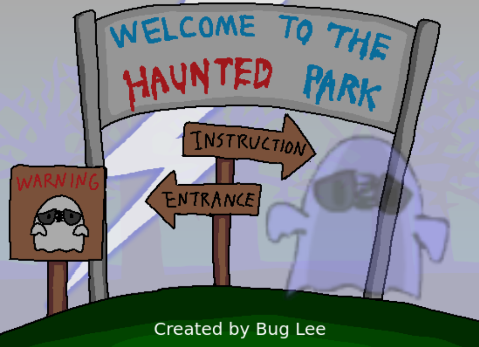

# The Haunted Park

## Introduction
The objective of the game is to escape the park by finding the escape route and the keys that are randomly placed somewhere in the game world to unlock the escape route. However, there are ghosts scattered around the map and the player must avoid them. When a ghost sees the player, the ghost will chase him/her. The player can distract a ghost by throwing a rock. The player wins when he/she successfully escapes and the score will be based on the time it took to escape. The game utilizes a ray-casting algorithm to give the player illusion of a 3-D world. 

## [Play the game](https://bug-vt.github.io/the_haunted_park/)

